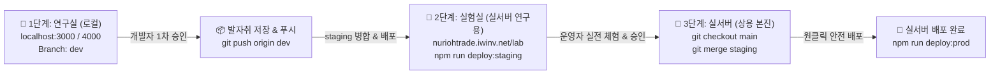

# 🧪 누리오(NURIOH) 3단계 개발·검증 파이프라인 가이드 (LAB_WORKFLOW.md)

> **문서 버전:** `v2.1.0`  
> **최초 작성일:** 2026-09-08  
> **작성자:** 누리오 AI 디자인실장 & 마스터 개발자 이승호 대표님  
> **3대 운영 공간 정의:**
> 1. **연구실 (Local LAB):** 개발자(대표님) 전용 로컬 개발 & 디버깅 공간 (`localhost:3000`, `dev` 브랜치)
> 2. **실험실 (Staging LAB):** 운영자 실전 검증 & 사전 체험 호스팅 공간 (`nuriohtrade.iwinv.net/lab`, `staging` 브랜치)
> 3. **실서버 (Production Live):** 모든 회원과 운영자가 실제 자산을 운용하는 상용 공간 (`nuriohtrade.iwinv.net`, `main` 브랜치)

---

## 🏛️ 1. 3단계 핵심 원칙 (Rule of Thumb)

1. **`실서버(main)` 직접 수정 절대 금지!**  
   - 모든 새로운 기능 개발과 디자인 수정은 무조건 **연구실(`dev` 브랜치)**에서 시작합니다.
2. **반드시 `실험실`을 거치는 2중 승인 (Verify Through Staging):**  
   - 연구실(로컬)에서 통과된 코드는 **실험실(실서버 웹)**에 먼저 배포하여 운영자가 직접 사용해 보고 승인한 뒤에만 실서버로 승격합니다.

---

## 🔄 2. 3단계 파이프라인 워크플로우 (SOP)



### [1단계] 연구실 (Local LAB - 대표님 공간)
- **목적:** 내 PC에서 기능 개발, UI 디자인, 로직 개선 및 시뮬레이션 테스트
- **접속 주소:** `http://localhost:3000` (백엔드: `localhost:4000`)
- **브랜치:** `dev`
- **구동 명령어:**
  ```bash
  npm run dev
  ```
- **검증 후 저장 및 푸시:**
  ```bash
  git add .
  git commit -m "feat(lab): 신규 기능 구현"
  git push origin dev
  ```

---

### [2단계] 실험실 (Staging LAB - 운영자 검증 공간)
- **목적:** 실제 호스팅 환경에서 운영자가 제안 기능 및 UX를 직접 조작하며 검증
- **접속 주소:** `http://nuriohtrade.iwinv.net/lab`
- **브랜치:** `staging`
- **실행 절차:**
  ```bash
  # 1. staging 브랜치로 이동 및 dev 최신 내용 병합
  git checkout staging
  git merge dev
  git push origin staging

  # 2. 실험실 원클릭 배포 (/public_html/lab)
  npm run deploy:staging

  # 3. 작업 브랜치 dev(연구실)로 다시 복귀
  git checkout dev
  ```

---

### [3단계] 실서버 (Production Live - 전체 회원 상용 공간)
- **목적:** 운영자와 대표님의 상호 승인이 완료된 무결점 코드를 전체 상용 서버에 적용
- **브랜치:** `main`
- **실행 절차:**
  ```bash
  # 1. main 브랜치로 이동 및 검증된 staging 병합
  git checkout main
  git merge staging
  git push origin main

  # 2. 상용 실서버 원클릭 배포 (/public_html)
  npm run deploy:prod

  # 3. 작업 브랜치 dev로 다시 복귀
  git checkout dev
  ```
- **상용 서비스 URL:** `http://nuriohtrade.iwinv.net`

---

## 💻 3. 다른 컴퓨터(노트북, 사무실 PC)에서 작업 이어갈 때 (30초 체크리스트)

대표님이 다른 컴퓨터로 이동하셨을 때 아래 3단계를 순서대로 실행하시면 바로 100% 동일한 상태에서 작업을 이어갈 수 있습니다!

### 1단계: 프로젝트 폴더 열기 & Git 상태 확인
```bash
# 최신 원격 변경사항 가져오기
git fetch --all

# 연구실 브랜치로 전환 및 최신화
git checkout dev
git pull origin dev
```

### 2단계: 의존성 패키지 동기화 (필요 시)
새로운 라이브러리가 추가되었을 수 있으므로 설치를 점검합니다.
```bash
# 루트 의존성 확인
npm install

# 대시보드 의존성 확인
cd dashboard
npm install
cd ..
```

### 3단계: 환경설정(.env) 확인
- `.env` 파일이 있는지 확인합니다 (Git에 포함되지 않는 보안 키 파일).
- 시놀로지 드라이브를 공유 폴더로 사용하는 경우 `.env`가 자동 동기화되지만, 새 PC에서 새로 `git clone` 받은 경우 기존 PC의 `.env` 내용을 복사해 넣습니다.

---

## 🚨 4. 비상 탈출 (Emergency Rollback) 가이드

만약 실서버 배포 후 예상치 못한 오류가 발견되어 즉시 이전 버전으로 되돌려야 할 때:

```bash
# 1. main 브랜치에서 바로 직전 커밋으로 되돌리기
git checkout main
git reset --hard HEAD~1

# 2. 이전 안정 버전으로 즉시 재빌드 & 재배포 (1분 소요)
npm run deploy
```

---

## 📋 5. 연구실 작업 발자취 관리 규칙

1. **커밋 메시지 규칙:**
   - `feat(lab): ...` : 연구실 신규 기능 개발
   - `fix(lab): ...` : 연구실 버그 수정
   - `test(lab): ...` : 연구실 테스트 코드 작성 및 검증
   - `release: vX.X.X` : 실서버 배포 버전 릴리즈 (`main` 브랜치)
2. **개발 메모 업데이트:**
   - 중요한 구조 변경이나 알고리즘 추가 시 `PROJECT_DEVELOPMENT_MEMO.md`에 날짜와 버전, 해결 내용을 1~2줄 요약 기록합니다.

---
*Created by NURIOH AI Design Lead & Jay @ Connect AI LAB*
