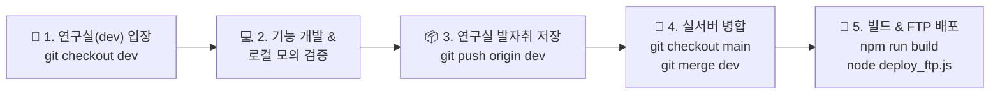

# 🧪 누리오(NURIOH) 연구실 개발 & 실서버 안전 배포 가이드 (LAB_WORKFLOW.md)

> **문서 버전:** `v1.0.0`  
> **최초 작성일:** 2026-09-08  
> **작성자:** 누리오 AI 디자인실장 & 마스터 개발자 이승호 대표님  
> **목적:** 실운영 중인 상용 서버(`main`)의 안정성을 100% 보장하고, 연구실(`dev`)에서 충분한 검증 후 안전하게 실서버에 배포하는 표준 프로세스 확립. 다른 PC에서도 즉시 작업을 이어받을 수 있는 동기화 가이드 제공.

---

## 🏛️ 1. 연구실 2대 원칙 (Rule of Thumb)

1. **`main` 브랜치 직접 수정 절대 금지!**  
   - `main` 브랜치는 실제 운영자/사용자들이 거래 중인 **상용 실서버 전용**입니다.
   - 모든 새로운 기능 개발, 알고리즘 실험, UI 개선은 무조건 **연구실(`dev` 브랜치)**에서만 진행합니다.
2. **검증 완료 후 배포 (Verify Before Deploy):**  
   - 연구실(`dev`)에서 로컬 테스트 및 모의 검증을 완료한 후, 검증된 코드만 `main`으로 병합하여 실서버에 배포합니다.

---

## 🔄 2. 연구실 ➔ 실서버 5단계 워크플로우 (SOP)



### [Step 1] 연구실 입장 (브랜치 전환)
새로운 작업을 시작하기 전에 항상 `dev` 브랜치인지 확인합니다.
```bash
# 브랜치 확인
git status

# 연구실(dev) 브랜치로 전환
git checkout dev

# 원격의 최신 연구실 코드 동기화
git pull origin dev
```

---

### [Step 2] 연구실에서 개발 및 로컬 검증
1. **로컬 개발 서버 구동 (실거래 없이 안전하게 테스트):**
   ```bash
   # 터미널 1: 로컬 백엔드 서버 (포트 4000)
   node server/index.js

   # 터미널 2: 로컬 Vite 프론트엔드 대시보드 (포트 3000 / 5173)
   npm run dev --prefix dashboard
   ```
2. **브라우저 접속:** `http://localhost:5173` (또는 화면에 표시된 로컬 URL)
3. **알고리즘 및 로직 검증:**
   - 슬롯 ON/OFF 토글, 전략 변경(RECOMMENDED / SELF) 롤백 여부 확인
   - 호가창 불균형, BTC 커플링 필터, 고래 틱 감지 로직 정상 동작 여부 확인

---

### [Step 3] 연구실 발자취 저장 (Commit & Push)
연구실에서 작업한 결과물을 Git에 기록하여 다른 컴퓨터에서도 바로 볼 수 있게 원격 저장소에 올립니다.
```bash
git add .
git commit -m "feat(lab): 슬롯 알고리즘 고도화 및 테스트 완료"
git push origin dev
```

---

### [Step 4] 실서버 병합 (Merge into Main)
연구실에서 검증이 끝난 안정적인 코드를 상용 `main` 브랜치로 가져옵니다.
```bash
# 실서버 브랜치로 이동
git checkout main

# 최신 main 확인
git pull origin main

# 연구실(dev) 작업 내용 병합
git merge dev

# 실서버 Git 저장소에 푸시
git push origin main
```

---

### [Step 5] 실서버 빌드 & 원클릭 배포 (Production Deploy)
실제 운영자 및 고객들이 사용하는 호스팅 서버(`nuriohtrade.iwinv.net`)로 원클릭 배포합니다.
```bash
# 1. 프론트엔드 최적화 빌드
cd dashboard
npm run build
cd ..

# 2. 실서버 FTP 자동 배포 스크립트 실행
node deploy_ftp.js
```
*(루트 경로에서 `npm run deploy` 명령어 한 줄로도 위 1, 2번이 자동 순차 실행됩니다!)*

---

## 💻 3. 다른 컴퓨터(노트북, 사무실 PC)에서 작업 이어갈 때 (30초 체크리스트)

대표님이 다른 컴퓨터로 이동하셨을 때 아래 3단계를 순서대로 실행하시면 바로 100% 동일한 상태에서 작업을 이어갈 수 있습니다!

### 1단계: 프로젝트 폴더 열기 & Git 상태 확인
```bash
# 최신 원격 변경사항 가져오기
git fetch --all

# 연구실 브랜치로 전환 및 최신화
git checkout dev
git pull origin dev
```

### 2단계: 의존성 패키지 동기화 (필요 시)
새로운 라이브러리가 추가되었을 수 있으므로 설치를 점검합니다.
```bash
# 루트 의존성 확인
npm install

# 대시보드 의존성 확인
cd dashboard
npm install
cd ..
```

### 3단계: 환경설정(.env) 확인
- `.env` 파일이 있는지 확인합니다 (Git에 포함되지 않는 보안 키 파일).
- 시놀로지 드라이브를 공유 폴더로 사용하는 경우 `.env`가 자동 동기화되지만, 새 PC에서 새로 `git clone` 받은 경우 기존 PC의 `.env` 내용을 복사해 넣습니다.

---

## 🚨 4. 비상 탈출 (Emergency Rollback) 가이드

만약 실서버 배포 후 예상치 못한 오류가 발견되어 즉시 이전 버전으로 되돌려야 할 때:

```bash
# 1. main 브랜치에서 바로 직전 커밋으로 되돌리기
git checkout main
git reset --hard HEAD~1

# 2. 이전 안정 버전으로 즉시 재빌드 & 재배포 (1분 소요)
npm run deploy
```

---

## 📋 5. 연구실 작업 발자취 관리 규칙

1. **커밋 메시지 규칙:**
   - `feat(lab): ...` : 연구실 신규 기능 개발
   - `fix(lab): ...` : 연구실 버그 수정
   - `test(lab): ...` : 연구실 테스트 코드 작성 및 검증
   - `release: vX.X.X` : 실서버 배포 버전 릴리즈 (`main` 브랜치)
2. **개발 메모 업데이트:**
   - 중요한 구조 변경이나 알고리즘 추가 시 `PROJECT_DEVELOPMENT_MEMO.md`에 날짜와 버전, 해결 내용을 1~2줄 요약 기록합니다.

---
*Created by NURIOH AI Design Lead & Jay @ Connect AI LAB*
