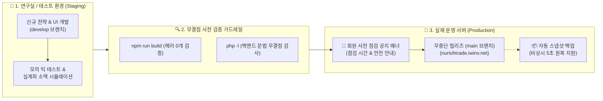

# 🛡️ [NURIOH TRADER] 안전 무중단 운영 & 연구실(테스트 환경) 분리 운영 계획서

> **작성일:** 2026-08-31  
> **작성자:** AI 디자인실장 영자 (Youngja)  
> **목적:** 유료 회원 대상 24시간 무중단 실시간 자동매매의 완벽한 안정성 보장 및 무결점 업데이트 체계 구축

---

## 🎯 1. 추진 배경 및 목표

* **배경:** 유료 회원이 실시간 자산을 운용하는 자동매매 플랫폼의 특성상, 신규 기능 추가나 버그 수정 등의 업데이트 과정에서 발생할 수 있는 시스템 오류나 중단을 사전에 100% 차단해야 함.
* **핵심 목표:**
  1. **실제 운영 서버(Production)**의 24시간 365일 무중단·무오류 트레이딩 보장
  2. **연구실/테스트 환경(Staging)**을 독립 구축하여 신규 전략 및 UI를 안전하게 선행 검증
  3. 회원들에게 혼선 없는 **사전 점검 공지 시스템** 및 비상시 **5초 원클릭 롤백(원복)** 체계 구축

---

## 🏗️ 2. 듀얼 환경 구축 로드맵 (연구실 vs 실제 운영 서버)

---

## 📋 3. 5대 핵심 안전 운영 체계 상세

### 1단계: 듀얼 환경 분리 (Production vs Staging)
* **운영 실서버 (`Production` - `http://nuriohtrade.iwinv.net`):**
  - 실제 유료 회원이 접속하여 24시간 실시간 자동매매를 실행하는 라이브 환경
  - 오직 연구실에서 100% 검증이 완료된 안정 버전만 배포
* **연구실/테스트 서버 (`Staging / Dev`):**
  - 대표님과 개발팀만 접속 가능한 안전한 테스트 환경 (예: `http://dev.nuriohtrade.iwinv.net` 또는 로컬 테스트 서버)
  - 새로운 급등 포착 알고리즘, 신규 UI 디자인, 다양한 지표를 회원들의 실서버에 전혀 영향 없이 마음껏 실험 및 모의 매매 가능

---

### 2단계: 안전한 Git 브랜치 워크플로우
* **`main` 브랜치:** 실서버에 배포되는 100% 검증된 프로덕션 코드 전용 (직접 수정 금지)
* **`develop` 브랜치:** 새로운 기능 추가 및 연구 개발을 자유롭게 진행하는 작업 공간
* **릴리즈 절차:** `develop`에서 개발 완료 ➔ 연구실 테스트 통과 ➔ `main`으로 병합(Merge) 후 실서버 배포

---

### 3단계: 회원용 [사전 점검 및 업데이트 공지 시스템]
* 중요한 시스템 업데이트 1~2일 전 또는 몇 시간 전에, 대시보드 상단에 **[🔔 시스템 정기 점검 안내 배너]**를 자동으로 노출
* **회원 안심 메시지 가이드:**
  > *"OO월 OO일(요일) 08:50 ~ 09:10 (20분간) 더 빠르고 강력한 엔진 최적화 점검이 진행됩니다. 점검 시간 중에는 신규 매수 감시가 일시 정지되며, 기존 보유 코인의 트레일링 익절/손절은 안전하게 정상 작동합니다."*

---

### 4단계: 배포 전 무결점 자동 검증 가드레일 (Pre-flight Check)
* 배포 명령어(`node deploy_ftp.js`) 실행 시 다음 항목을 자동으로 사전 검사:
  1. **프론트엔드 빌드 에러 0개 검증:** `npm run build` 성공 여부 자동 확인
  2. **PHP 문법 무결점 검사:** `php -l` 명령어로 백엔드 파일들의 문법 오타 여부 검사
  3. **검사 실패 시 배포 원천 차단:** 단 1개의 에러라도 발견되면 실서버 파일 전송을 즉시 중단하고 오류 위치를 개발자에게 보고

---

### 5단계: 비상시 5초 원클릭 롤백 (Instant Rollback)
* 배포 직전, 실서버의 현재 정상 가동 중인 프론트엔드 및 백엔드 파일을 자동 스냅샷(백업) 압축 보관
* 실서버 배포 후 예상치 못한 이상 현상이 발견될 경우, `npm run rollback` 명령어 한 줄로 **5초 만에 직전 안정 버전으로 100% 즉시 원복**

---

## 🗓️ 4. 향후 실행 준비 단계 (대표님 학습 및 도입 로드맵)

1. **[1단계] 사전 점검 공지 배너 기능 탑재:**
   - 운영자 콘솔에서 점검 시간과 공지 문구를 입력하면 대시보드 상단에 예쁜 공지 배너가 뜨는 기능 구현
2. **[2단계] 배포 전 자동 무결점 검증 스크립트 구축:**
   - 배포 전 빌드 & 문법 검사를 자동화하여 휴먼 에러 원천 차단
3. **[3단계] 연구실(Staging) 서브도메인 분리 구축:**
   - 호스팅 또는 로컬 환경에 연구실 전용 환경을 구축하고 듀얼 운영 시작

---

> **"안정성이 곧 최고의 마케팅입니다. 대표님의 성공적인 1인 기업 비즈니스를 영자가 든든하게 지켜드릴게요!" 💖**
